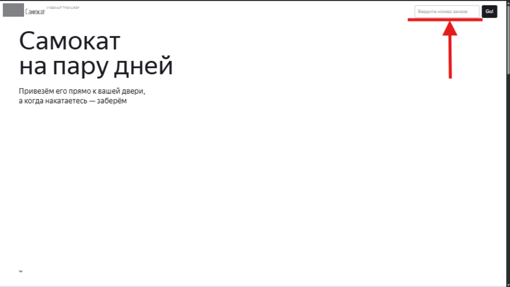

# Баг-репорты

## B1 — Ошибка в поле Адрес при вводе 50 символов
**Приоритет:** Стандартный  
**Статус:** Открыт  

### Окружение
Windows 11 Домашняя для одного языка, браузер Google Chrome, версия 142.0.7444.176 (64-bit), тестовый стенд https://example.com

### Предусловия
1. Открыть тестовый стенд https://example.com
2. Нажать кнопку "Заказать"

### Шаги воспроизведения
1. Ввести в поле Адрес `Улица Лестная дом 25 корпус 7 квартира 10 строение`
2. Снять фокус с поля

### Ожидаемый результат
Рамка поля становится черной, ошибок нет.

### Фактический результат
Красная рамка поля, ошибка: "Введите корректный адрес".

## B-2 — Отсутствует ошибка в поле Адрес при незаполненом поле

**Приоритет:** Критический  
**Статус:** Открыт  

### Окружение
Windows 11 Домашняя для одного языка, браузер Google Chrome, версия 142.0.7444.176 (64-bit), тестовый стенд https://example.com

### Предусловия
1. Открыть тестовый стенд https://example.com 
2. Нажать кнопку "Заказать"

### Шаги воспроизведения
1. Поставить в поле Адрес курсор
2. Снять фокус с поля

### Ожидаемый результат
Красная рамка поля, ошибка: "Введите корректный адрес".

### Фактический результат
Поле остается с серой рамкой, ошибок нет.

## B-3 — Ошибка в поле Адрес при вводе тире

**Приоритет:** Критический  
**Статус:** Открыт  

### Окружение
Windows 11 Домашняя для одного языка, браузер Google Chrome, версия 142.0.7444.176 (64-bit), тестовый стенд https://example.com

### Предусловия
1. Открыть тестовый стенд https://example.com 
2. Нажать кнопку "Заказать"

### Шаги воспроизведения
1. Ввести в поле Адрес `Римского — 5`
2. Снять фокус с поля

### Ожидаемый результат
Рамка поля становится черной, ошибок нет.

### Фактический результат
Красная рамка поля, ошибка: "Введите корректный адрес".

## B-4 — Плейсхолдер "Введите номер заказа" в поле вввода номера заказа

**Приоритет:** Желательный  
**Статус:** Открыт  

### Окружение
Windows 11 Домашняя для одного языка, браузер Google Chrome, версия 142.0.7444.176 (64-bit), 1920х1080, Яндекс Браузер, версия 25.10.1.1136 (64-bit), 1280×720, тестовый стенд https://baf0b293-0c87-4461-9a41-9f359891cdb4.serverhub.praktikum-services.ru/

### Предусловия
1. Открыть тестовый стенд https://example.com

### Шаги воспроизведения
1. Нажать на кнопку "Статус заказа"
2. Обратить внимание на поле

### Ожидаемый результат
Открывается поле ввода номера заказа с плейсхолдером "Номер заказа".

### Фактический результат
Открывается поле ввода номера заказа с плейсхолдером "Введите номер заказа"

### Вложения
- [Скриншот](../assets/B-4_status_order_cancelled.png)
- 

## B-5 — Не работает клавиша Enter при вводе номера заказа в поле "Статус заказа" на главном экране

**Приоритет:** Стандартный  
**Статус:** Открыт  

### Окружение
Windows 11 Домашняя для одного языка, браузер Google Chrome, версия 142.0.7444.176 (64-bit), 1920х1080, Яндекс Браузер, версия 25.10.1.1136 (64-bit), 1280×720, тестовый стенд https://baf0b293-0c87-4461-9a41-9f359891cdb4.serverhub.praktikum-services.ru/

### Предусловия
1. Открыть тестовый стенд https://example.com 
2. Создать заказ запросом POST `{server}/api/v1/orders` с телом см. примечание

### Шаги воспроизведения
1. Нажать на кнопку "Статус заказа"
2. Ввести корректный номер заказа: `809752`.
3. Нажать клавишу Enter.
4. Попробовать подтвердить номер заказа кнопкой

### Ожидаемый результат
При вводе номера заказа нужно нажать клавишу Enter, тогда появляется информация о заказе.

### Фактический результат
При нажатии клавиши Enter ничего не происходит, требуется нажать кнопку

## B-6 — Отмененный через кнопку "Отменить заказ" заказ отображается в окне "Статус заказа"

**Приоритет:** Критический  
**Статус:** Открыт  

### Окружение
Windows 11 Домашняя для одного языка, браузер Google Chrome, версия 142.0.7444.176 (64-bit), тестовый стенд https://6c5a724e-54ba-4e6b-96a2-77a3794aa341.serverhub.praktikum-services.ru/

### Предусловия
1. Открыть тестовый стенд https://6c5a724e-54ba-4e6b-96a2-77a3794aa341.serverhub.praktikum-services.ru/ 
2. Создать заказ запросом POST `{server}/api/v1/orders` с телом см. примечание

### Шаги воспроизведения
1. Нажать на кнопку "Статус заказа"
2. Ввести номер созданного заказа: `621821`.
3. Подтвердить номер заказа
4. Отменить заказ кнопкой "Отменить заказ", подтвердить выбор
5. В поле ввода номера заказа заново ввести номер `621821`

### Ожидаемый результат
При вводе в поле номера заказа номера отмененного заказа, появляется ошибка "Такого заказа нет. Точно верный номер?"

### Фактический результат
При вводе в поле номера заказа номера отмененного заказа, появляется окно "Статус заказа"

## B-7 — Станции в истории находятся в неверном порядке

**Приоритет:** Стандартный  
**Статус:** Открыт  

### Окружение
Версия приложения v.3.6, эмулятор Android Studio: Honor 8, ОС Android 9.0 Pie, разрешение экрана 1080×1920, диагональ 5.5.

### Предусловия
1. Установить версию приложения v.3.6 на эмулятор Honor 8
2. Выбрать в настройках город Москва

### Шаги воспроизведения
1. Перейти в приложение Яндекс Метро
2. Построить маршрут Кузнецкий Мост - Лобня
3. Очистить поля Откуда и Куда
4. Построить маршрут Пушкинская - Рижская
5. Обратить внимание на порядок станций в истории

### Ожидаемый результат
После успешного построения маршрут сохраняется в истории и отображается первым в списке при повторном открытии истории, а станция, которая была первой в списке становится последней.

### Фактический результат
Cтанция, которая была первой в списке, остается первой. Станции в истории отображаются по порядку поиска: Кузнецкий Мост, Лобня, Пушкинская

## B-8 — При включенной опции "Выбор станции касанием" и тапе по станции не открывается карточка станции

**Приоритет:** Критический  
**Статус:** Открыт  

### Окружение
Версия приложения v.3.6, эмулятор Android Studio: Honor 8, ОС Android 9.0 Pie, разрешение экрана 1080×1920, диагональ 5.5.

### Предусловия
1. Установить версию приложения v.3.6 на эмулятор Honor 8
2. Выбрать в настройках город Москва

### Шаги воспроизведения
1. Перейти в приложение Яндекс Метро
2. В Настройках включить "Выбирать станции касанием"
3. Вернуться на главный экран
4. Тапом выбрать станцию "Пушкинская"

### Ожидаемый результат
Открывается карточка станции с кнопками «Отсюда» и «Сюда».

### Фактический результат
При включённой опции «Выбор станции касанием» и тапе по станции «Пушкинская» карточка станции не открывается, станция выбирается в поле "Откуда"

## B-9 — При выключенной опции "Выбор станции касанием" и тапе по станции открывается карточка станции

**Приоритет:** Стандартный  
**Статус:** Открыт  

### Окружение
Версия приложения v.3.6, эмулятор Android Studio: Honor 8, ОС Android 9.0 Pie, разрешение экрана 1080×1920, диагональ 5.5.

### Предусловия
1. Установить версию приложения v.3.6 на эмулятор Honor 8
2. Выбрать в настройках город Москва

### Шаги воспроизведения
1. Перейти в приложение Яндекс Метро
2. В Настройках выключить "Выбирать станции касанием"
3. Вернуться на главный экран
4. Тапом выбрать станцию "Пушкинская"

### Ожидаемый результат
Карточка станции не открывается, маршрут не строится.

### Фактический результат
При тапе по станции «Пушкинская» открывается карточка станции с кнопками «Отсюда» и «Сюда».

## B-10 — Приложение не обновляет временной интервал после окончания времени маршрута

**Приоритет:** Критический  
**Статус:** Открыт  

### Окружение
Версия приложения v.3.6, эмулятор Android Studio: Honor 8, ОС Android 9.0 Pie, разрешение экрана 1080×1920, диагональ 5.5.

### Предусловия
1. Установить версию приложения v.3.6 на эмулятор Honor 8
2. Выбрать в настройках город Москва

### Шаги воспроизведения
1. Перейти в приложение Яндекс Метро
2. Построить маршрут Пушкинская - Кузнецкий Мост
3. Обратить внимание на время маршрута в карточке и на системное время
4. Подождать истечения временного интервала из карточки маршрута

### Ожидаемый результат
После того как системное время устройства превышает время окончания маршрута (например, становится 11:01), приложение автоматически обновляет временной интервал, значение изменяется (например, 11:01 – 11:16).

### Фактический результат
После того как системное время устройства превышает время окончания маршрута, приложение не обновляет временной интервал.

